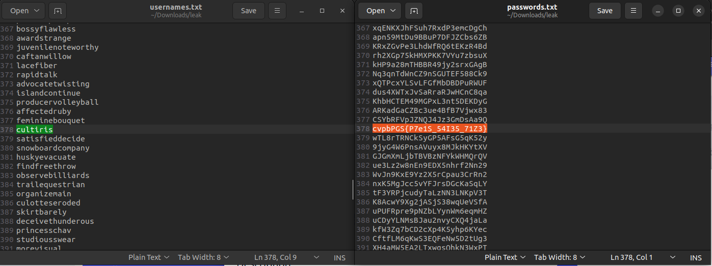
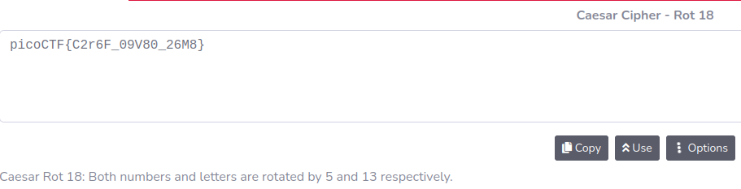
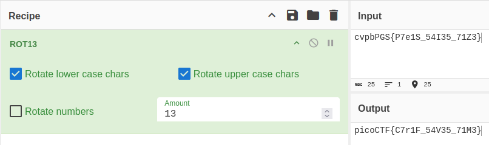

# Author: Will Hong / LT 'syreal' Jones

# Description:
- We found a leak of a blackmarket website's login credentials. Can you find the password of the user **cultiris** and successfully decrypt it?
- Download the leak [here](https://artifacts.picoctf.net/c/151/leak.tar).
- The first user in **usernames.txt** corresponds to the first password in **passwords.txt**. The second user corresponds to the second password, and so on.

# Hints:
1. Maybe other passwords will have hints about the leak?

# Solution:
- Find the password of the user **cultiris**

- [Tool](https://www.cachesleuth.com/multidecoder/)
- The flag is still not completely correct.

- So i try another ROT and it's correct now.

# Flag:
picoCTF{C7r1F_54V35_71M3}