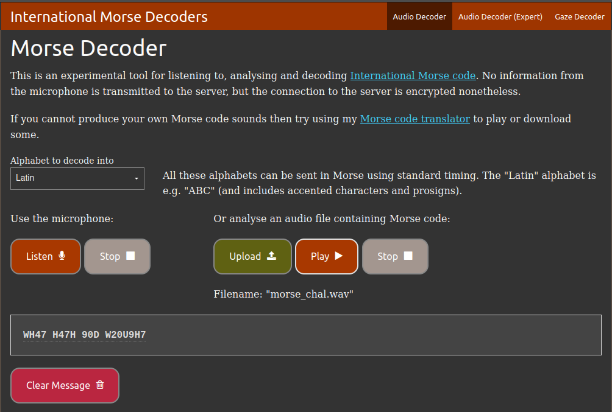

# Author: Will Hong

# Description:
- Morse code is well known. Can you decrypt this?
- Download the file [here](https://artifacts.picoctf.net/c/79/morse_chal.wav).
- Wrap your answer with picoCTF{}, put underscores in place of pauses, and use all lowercase.

# Hints:
1. Audacity is a really good program to analyze morse code audio.

# Solution:
- [morse code audio decoder online](https://morsecode.world/international/decoder/audio-decoder-adaptive.html)

# Flag:
picoCTF{wh47_h47h_90d_w20u9h7}