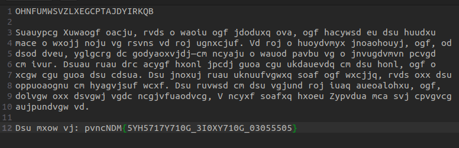
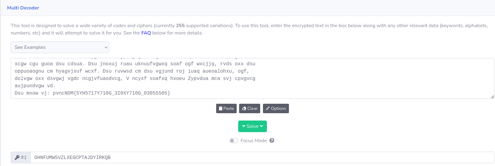
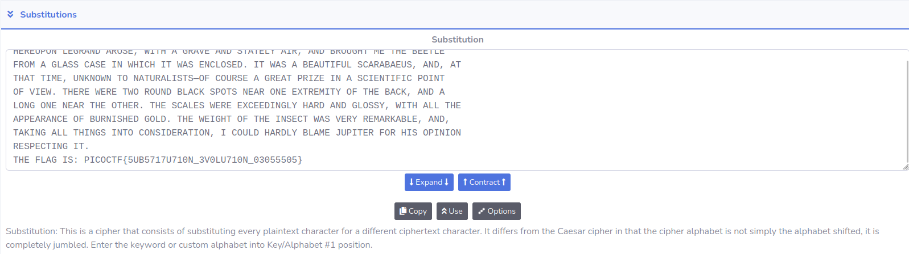

# Author: Will Hong

# Description:
- A message has come in but it seems to be all scrambled. Luckily it seems to have the key at the beginning. Can you crack this substitution cipher?
- Download the message [here](https://artifacts.picoctf.net/c/153/message.txt).

# Hints:
1. Try a frequency attack. An online tool might help.

# Solution:
- Line 1 looks like a key and line 12 look like a flag

- [Multi Decoder tool](https://www.cachesleuth.com/multidecoder/)

# Flag:
picoCTF{5UB5717U710N_3V0LU710N_03055505}