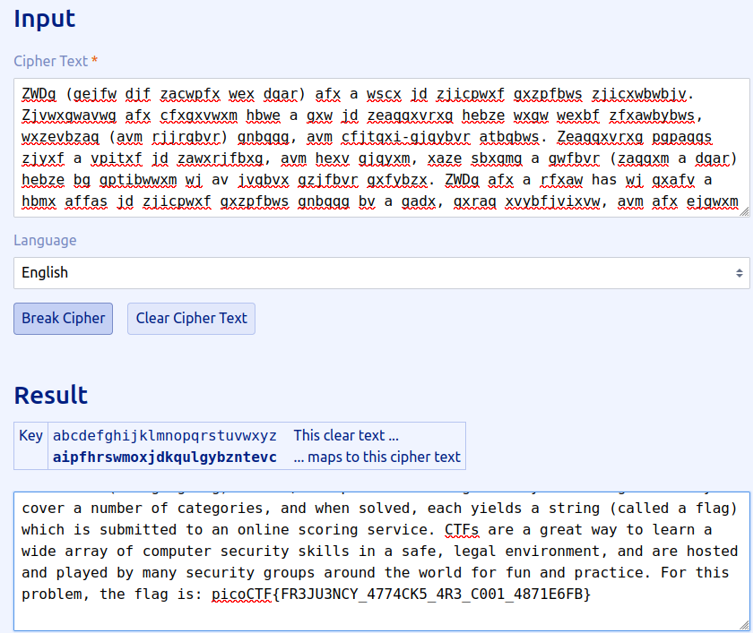

# Author: Will Hong

# Description:
- A second message has come in the mail, and it seems almost identical to the first one. Maybe the same thing will work again.
- Download the message [here](https://artifacts.picoctf.net/c/181/message.txt).

# Hints:
1. Try a frequency attack.
2. Do the punctuation and the individual words help you make any substitutions?

# Solution:
- [Tool](https://www.guballa.de/substitution-solver)
- You may have to decode it multiple times.
- The flag is still not completely correct.
- I think **FR3JU3NCY** seems similar to **FREQUENCY** so i replace **J** by **Q**

# Flag:
picoCTF{FR3QU3NCY_4774CK5_4R3_C001_4871E6FB}