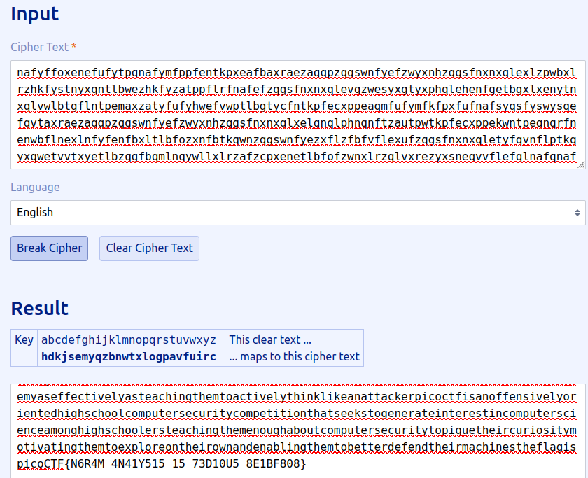

# Author: Will Hong

# Description:
- It seems that another encrypted message has been intercepted. The encryptor seems to have learned their lesson though and now there isn't any punctuation!
- Can you still crack the cipher?
- Download the message [here](https://artifacts.picoctf.net/c/112/message.txt).

# Hints:
1. Try refining your frequency attack, maybe analyzing groups of letters would improve your results?

# Solution:
- [Tool](https://www.guballa.de/substitution-solver)

# Flag:
picoCTF{N6R4M_4N41Y515_15_73D10U5_8E1BF808}