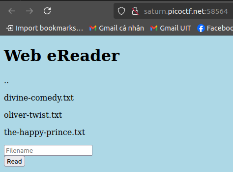
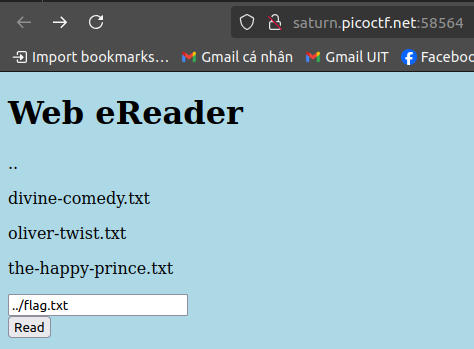
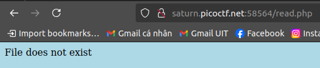
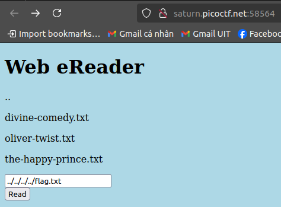
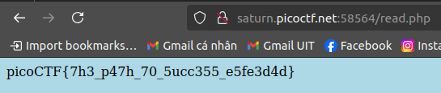

# Author: LT 'syreal' Jones

# Description:
- Can you get the flag?
- We know that the website files live in **/usr/share/nginx/html/** and the flag is at **/flag.txt** but the website is filtering absolute file paths. Can you get past the filter to read the flag?
- Here's the [website](http://saturn.picoctf.net:58564/).

# Solution:
- Access the website

- I tried reading those 3 files but no flag there
- So i go back (..) to find **flag.txt** 

- Keep going back until you can read flag.txt

# Flag:
picoCTF{7h3_p47h_70_5ucc355_e5fe3d4d}
