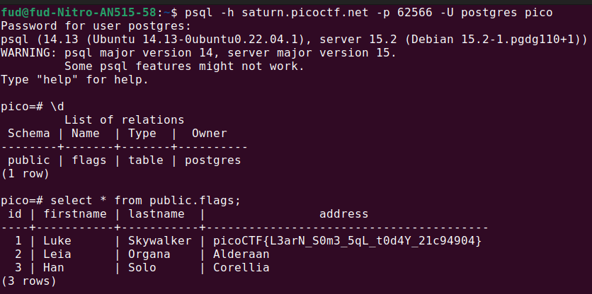

# Author: Mubarak Mikail / LT 'syreal' Jones

# Description:
- Connect to this PostgreSQL server and find the flag!
- **psql -h saturn.picoctf.net -p 62566 -U postgres pico**
- Password is **postgres**

# Hints:
1. What does a SQL database contain?

# Solution:

# Flag:
picoCTF{L3arN_S0m3_5qL_t0d4Y_21c94904}