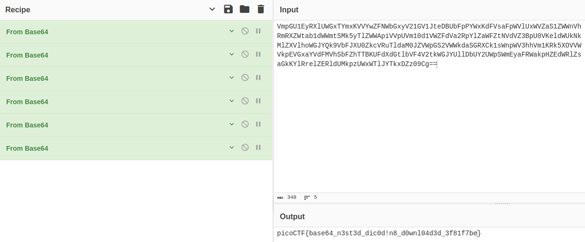

# Author: Theoneste Byagutangaza

# Description:
- Can you make sense of this file?

# Hints:
1. Multiple decoding is always good.

# Solution:
- Decode the Base64 string multiple time.

# Flag:
picoCTF{base64_n3st3d_dic0d!n8_d0wnl04d3d_3f81f7be}