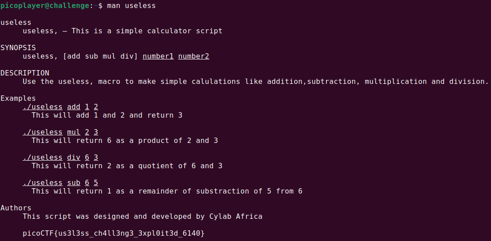

# Author: Loic Shema

# Description:
- There's an interesting script in the user's home directory.
- The work computer is running SSH. We've been given a script which performs some basic calculations, explore the script and find a flag.
    - Hostname: saturn.picoctf.net
    - Port:     57315
    - Username: picoplayer
    - Password: password

# Solution:
- Use **ssh picoplayer@saturn.picoctf.net -p 57315** to connect

- Let's see what's in **useless**

- I notice the "Read the manual" line so i try the **man** command

# Flag:
picoCTF{us3l3ss_ch4ll3ng3_3xpl0it3d_6140}
