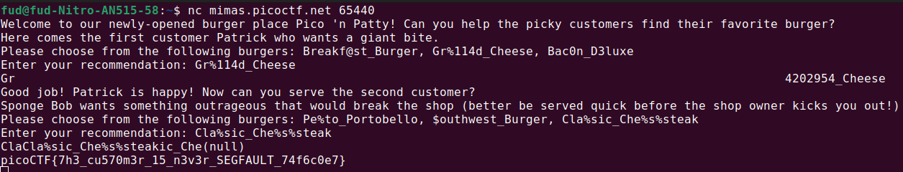

# Author: Cheng Zhang

# Description:
- Can you use your knowledge of format strings to make the customers happy?
- Connect with the challenge instance here: **nc mimas.picoctf.net 65440**

# Hints:
1. This is an introduction of format string vulnerabilities. Look up "format specifiers" if you have never seen them before.
2. Just try out the different options.

# Solution:
- Use **nc mimas.picoctf.net 65440** to connect.
- **Gr%114d_Cheese** contains **%114**, which may be related to specifying an unsafe format.
- **Cla%sic_Che%s%steak** contains **%s**, a format string that could allow you to read data from memory.

# Flag:
picoCTF{7h3_cu570m3r_15_n3v3r_SEGFAULT_74f6c0e7}