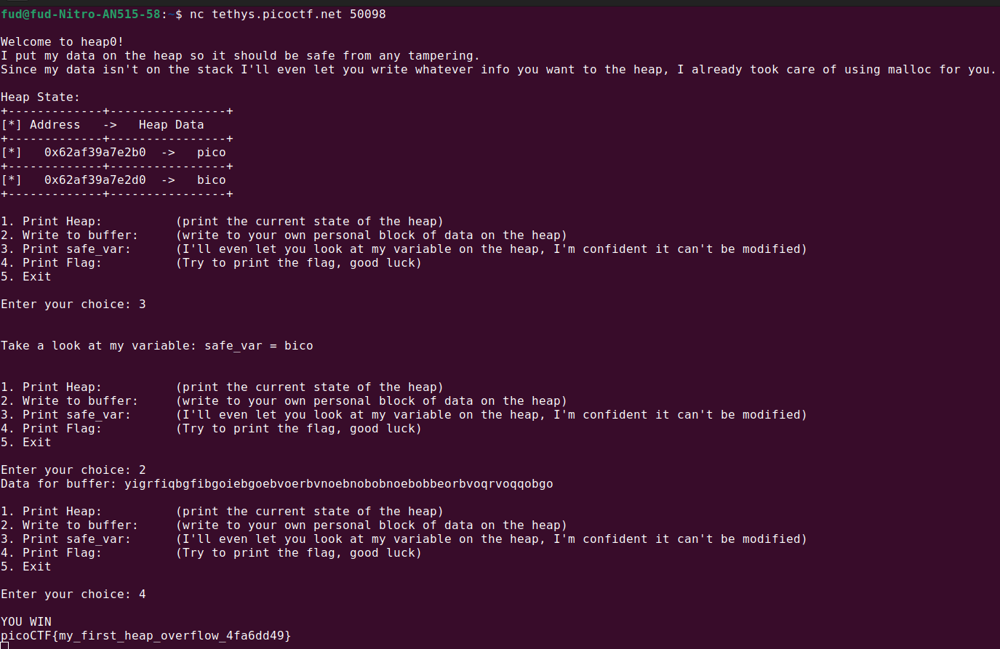

# Author: Abrxs, pr1or1tyQ

# Description:
- Are overflows just a stack concern?
- Connect with the challenge instance here: **nc tethys.picoctf.net 50098**

# Hints:
1. What part of the heap do you have control over and how far is it from the safe_var?

# Solution:
- Write a long enough string to the buffer and the flag will appear.

# Flag:
picoCTF{my_first_heap_overflow_4fa6dd49}