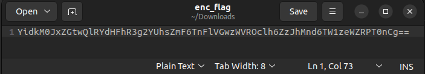
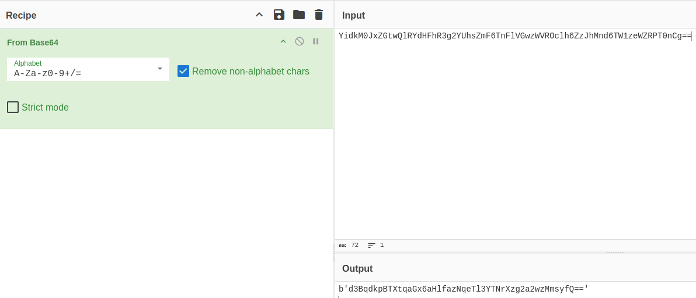
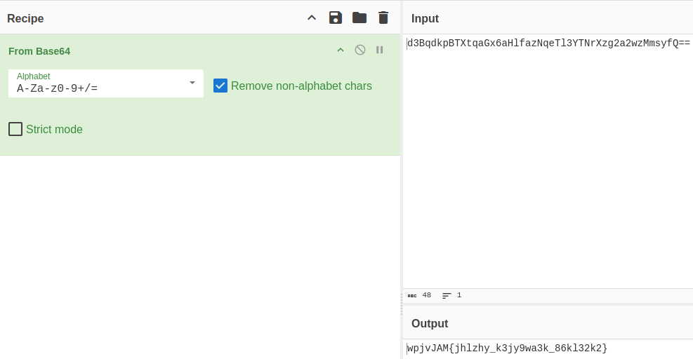
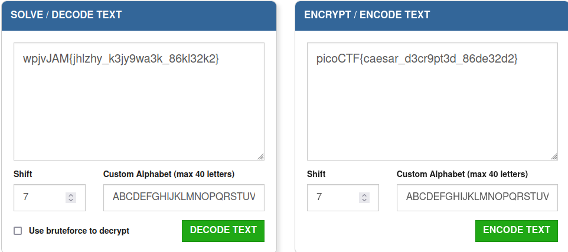

# Author: NGIRIMANA Schadrack

# Description:
- Can you get the real meaning from this file.

# Hints:
1. Engaging in various decoding processes is of utmost importance.

# Solution:
- enc_flag

- Decode it from Base64

- Decode one more time (just the part in the single quotation mark)

- It looks like the flag now so I use Caesar cipher decode

# Flag:
picoCTF{caesar_d3cr9pt3d_86de32d2}