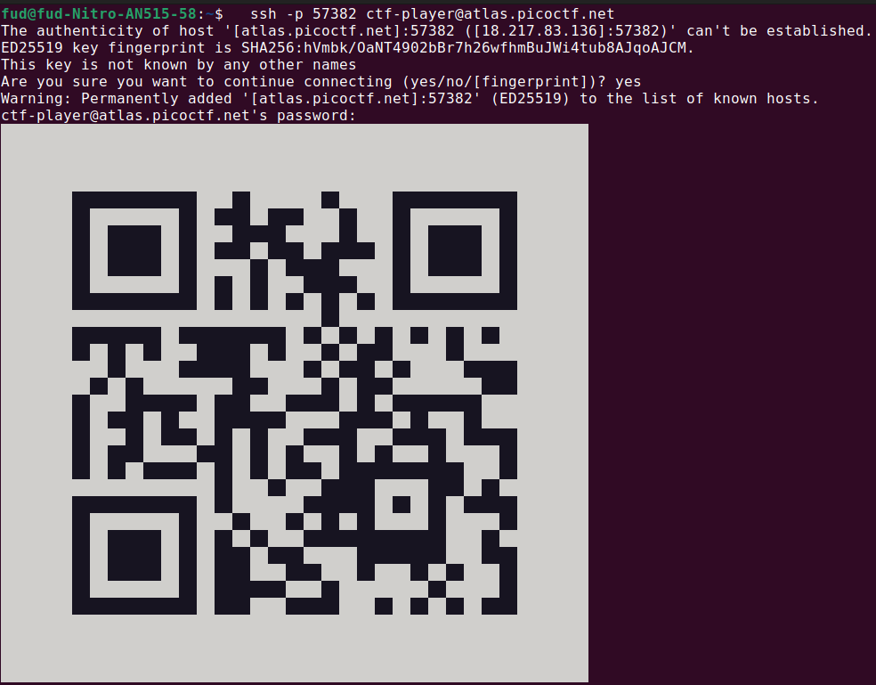

# Author: Jeffery John

# Description:
- I've gotten bored of handing out flags as text. Wouldn't it be cool if they were an image instead?
- The same files are accessible via SSH here:

        ssh -p 57382 ctf-player@atlas.picoctf.net

- Using the password **83dcefb7**. Accept the fingerprint with **yes**, and **ls** once connected to begin. Remember, in a shell, passwords are hidden!

# Hints:
1. QR codes are a way of encoding data. While they're most known for storing URLs, they can store other things too.
2. Mobile phones have included native QR code scanners in their cameras since version 8 (Oreo) and iOS 11.
3. If you don't have access to a phone, you can also use zbar-tools to convert an image to text.

# Solution:
- Connect and use a phone to scan the QR code

# Flag:
picoCTF{p33k_@_b00_3f7cf1ae}