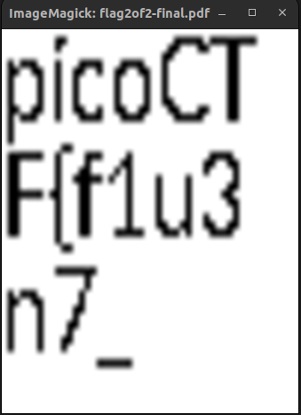
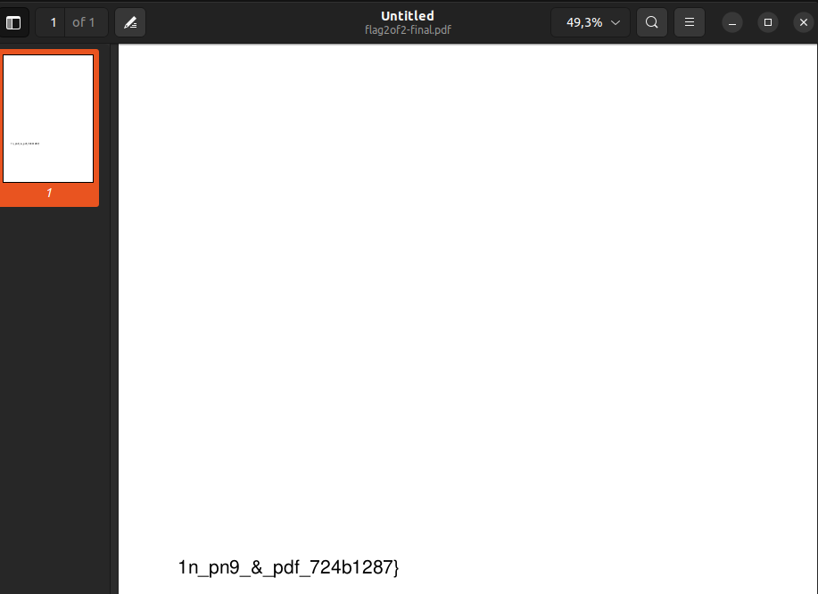

# Author: syreal

# Description:
- The Network Operations Center (NOC) of your local institution picked up a suspicious file, they're getting conflicting information on what type of file it is. They've brought you in as an external expert to examine the file. Can you extract all the information from this strange file?
- Download the suspicious file [here](https://artifacts.picoctf.net/c_titan/97/flag2of2-final.pdf). 

# Hints:
1. This problem can be solved by just opening the file in different ways.

# Solution:
-  Open with ImageMagicK, we got the first part.

- Open with Document Viewer, we got the final part

- Combine 2 parts, we'll have the flag.

# Flag:
picoCTF{f1u3n7_1n_pn9_&_pdf_724b1287}