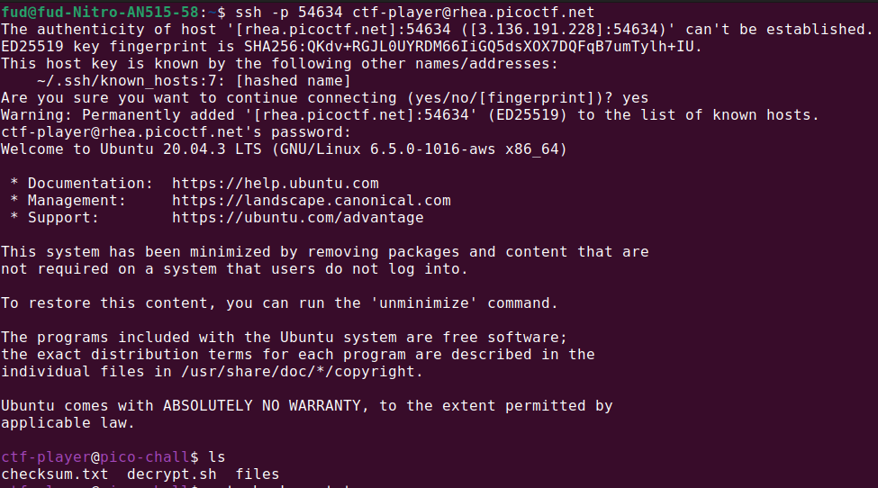
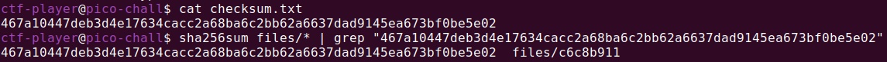
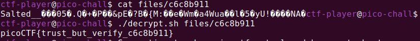

# Author: Jeffery John

# Description:
- People keep trying to trick my players with imitation flags. I want to make sure they get the real thing! I'm going to provide the SHA-256 hash and a decrypt script to help you know that my flags are legitimate.
- The same files are accessible via SSH here: 

        ssh -p 54634 ctf-player@rhea.picoctf.net

- Using the password **83dcefb7**. Accept the fingerprint with **yes**, and **ls** once connected to begin. Remember, in a shell, passwords are hidden!
    - Checksum: 467a10447deb3d4e17634cacc2a68ba6c2bb62a6637dad9145ea673bf0be5e02
    - To decrypt the file once you've verified the hash, run **./decrypt.sh files/`<file>`**.

# Hints:
1. Checksums let you tell if a file is complete and from the original distributor. If the hash doesn't match, it's a different file.
2. You can create a SHA checksum of a file with **sha256sum `<file>`** or all files in a directory with **sha256sum `<directory>/*`**.
3. Remember you can pipe the output of one command to another with **|**. Try practicing with the 'First Grep' challenge if you're stuck!

# Solution:
- Connect and **ls** to begin

- Check the checksum and find the target file which has the same checksum in **files** folder

- See what is in the target file by using the provided decrypt script. 

# Flag:
picoCTF{trust_but_verify_c6c8b911}