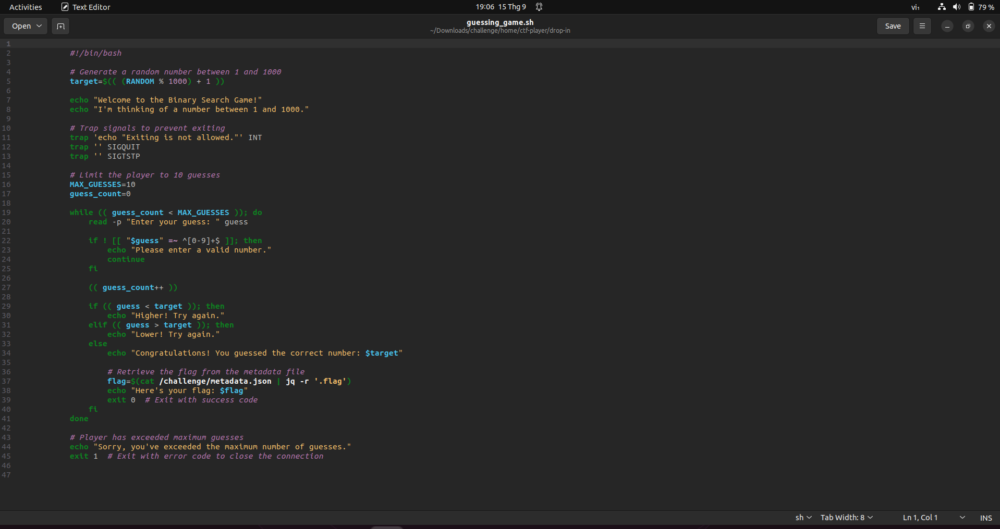
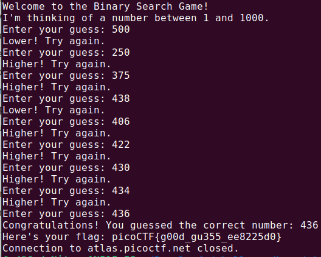

# Author: Jeffery John

# Description:
- Want to play a game? As you use more of the shell, you might be interested in how they work! Binary search is a classic algorithm used to quickly find an item in a sorted list. Can you find the flag? You'll have 1000 possibilities and only 10 guesses.
- Cyber security often has a huge amount of data to look through - from logs, vulnerability reports, and forensics. Practicing the fundamentals manually might help you in the future when you have to write your own tools!

# Hints:
1. Have you ever played hot or cold? Binary search is a bit like that.
2. You have a very limited number of guesses. Try larger jumps between numbers!
3. The program will randomly choose a new number each time you connect. You can always try again, but you should start your binary search over from the beginning - try around 500. Can you think of why?

# Solution:
- Guess a random number between 1 and 1000.

- Use Binary Search Algorithm to find the correct number.

    

# Flag: 
picoCTF{g00d_gu355_ee8225d0}
