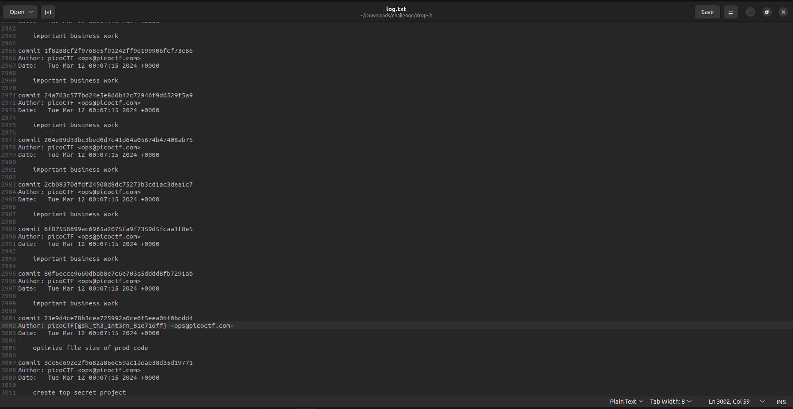

# Author: Jeffery John

# Description:
- Someone's commits seems to be preventing the program from working. Who is it?

# Hints:
1. In collaborative projects, many users can make many changes. How can you see the changes within one file?
2. Read the chapter on Git from the picoPrimer [here](https://primer.picoctf.org/#_git_version_control).
3. You can use **python3 `<file>`.py** to try running the code, though you won't need to for this challenge.

# Solution:
- The log is too large for the terminal, so i write it to **log.txt** with the **'git log > log.txt'** command and scroll to the end.

# Flag:
picoCTF{@sk_th3_1nt3rn_81e716ff}