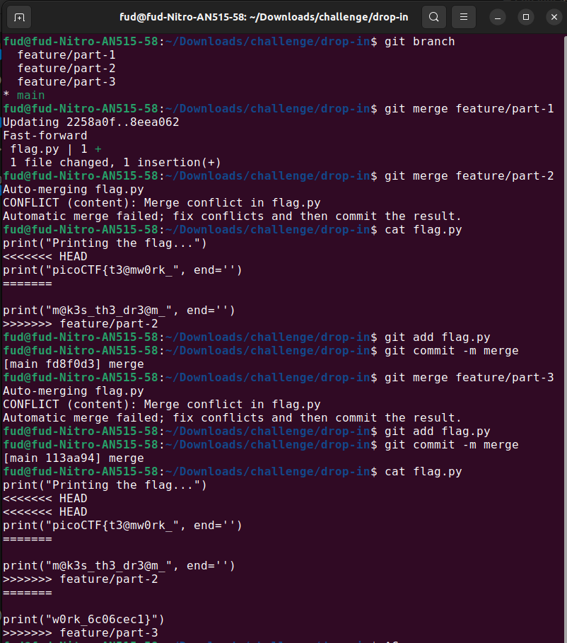

# Author: Jeffery John

# Description:
- My team has been working very hard on new features for our flag printing program! I wonder how they'll work together?

# Hints:
1. **git branch -a** will let you see available branches
2. How can file 'diffs' be brought to the main branch? Don't forget to **git config**!
3. Merge conflicts can be tricky! Try a text editor like nano, emacs, or vim.

# Solution:

# Flag:
picoCTF{t3@mw0rk_m@k3s_th3_dr3@m_w0rk_6c06cec1}