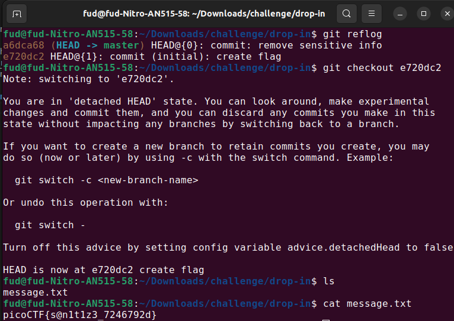

# Author: Jeffery John

# Description:
- I accidentally wrote the flag down. Good thing I deleted it!

# Hints:
1. Version control can help you recover files if you change or lose them!
2. Read the chapter on Git from the picoPrimer [here](https://primer.picoctf.org/#_git_version_control)
3. You can 'checkout' commits to see the files inside them

# Solution:
- git reflog: see the information recorded in the reflogs.
- git checkout e720dc2: back to the 'create flag' commit.

# Flag:
picoCTF{s@n1t1z3_7246792d}