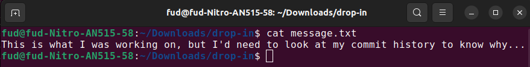
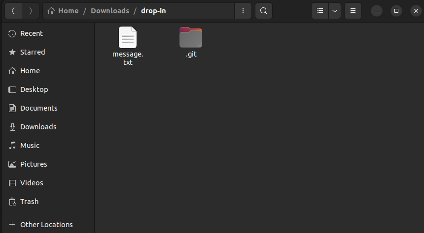
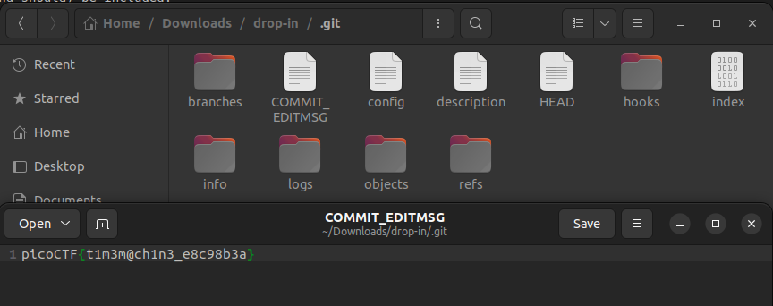

# Author: Jeffery John

# Description:
- What was I last working on? I remember writing a note to help me remember...

# Hints:
1. The **cat** command will let you read a file, but that won't help you here!
2. Read the chapter on Git from the picoPrimer [here](https://primer.picoctf.org/#_git_version_control).
3. When committing a file with git, a message can (and should) be included.

# Solution:
1. Message:

2. Open **.git** folder (remember to turn on Show Hidden Files option).

3. Flag is in the COMMIT_EDITMSG file.

# Flag:
picoCTF{t1m3m@ch1n3_e8c98b3a}
