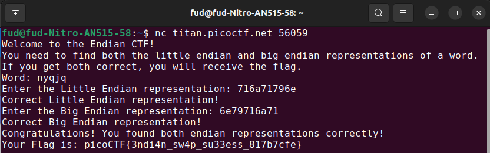

# Author: Nana Ama Atombo-Sackey

# Description:
- Know of little and big endian?
- nc titan.picoctf.net 56059

# Hints:
- You might want to check the ASCII table to first find the hexadecimal representation of characters before finding the endianness.
- Read more about how endianness [here](https://levelup.gitconnected.com/little-endian-and-big-endian-74ab6441b2a7)

# Solution:
- Little Endian: the least significant byte (LSB) is stored at the lowest memory address.
- Big Endian: the most significant byte (MSB) is stored at the lowest memory address 

# Flag:
picoCTF{3ndi4n_sw4p_su33ess_817b7cfe}