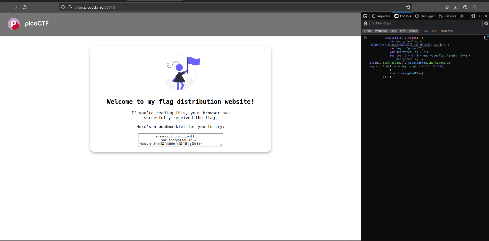
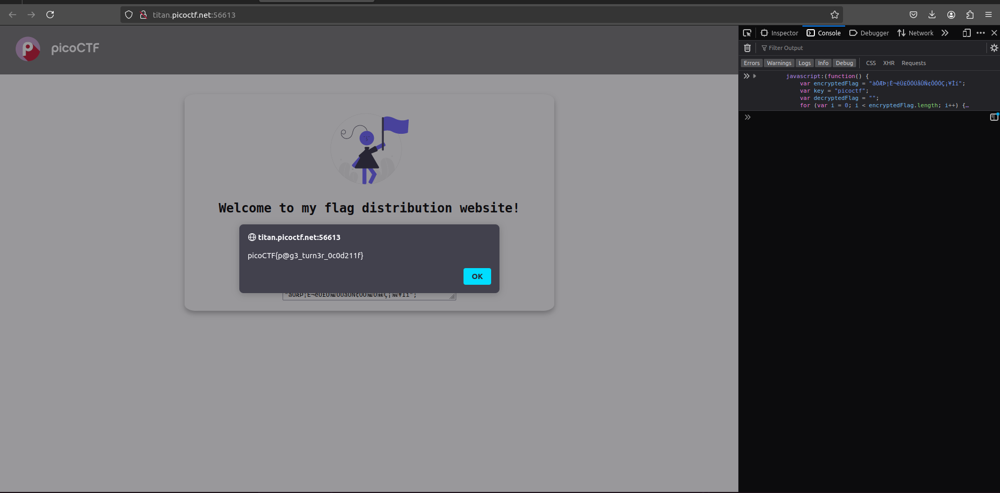

# Author: Jeffery John

# Description:
- Why search for the flag when I can make a bookmarklet to print it for me?
- Browse [here](http://titan.picoctf.net:56613/), and find the flag!

# Hints:
1. A bookmarklet is a bookmark that runs JavaScript instead of loading a webpage.
2. What happens when you click a bookmarklet?
3. Web browsers have other ways to run JavaScript too.

# Solution:
- Copy the javascript function and paste it in console tab then press Enter

# Flag:
picoCTF{p@g3_turn3r_0c0d211f}