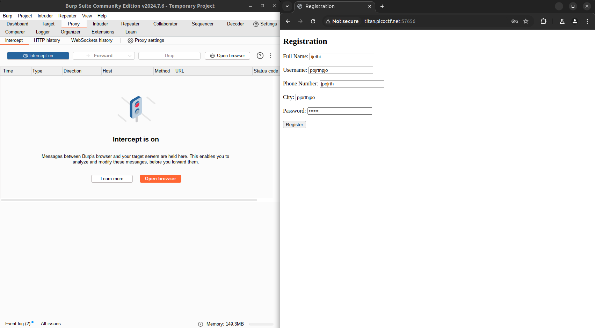
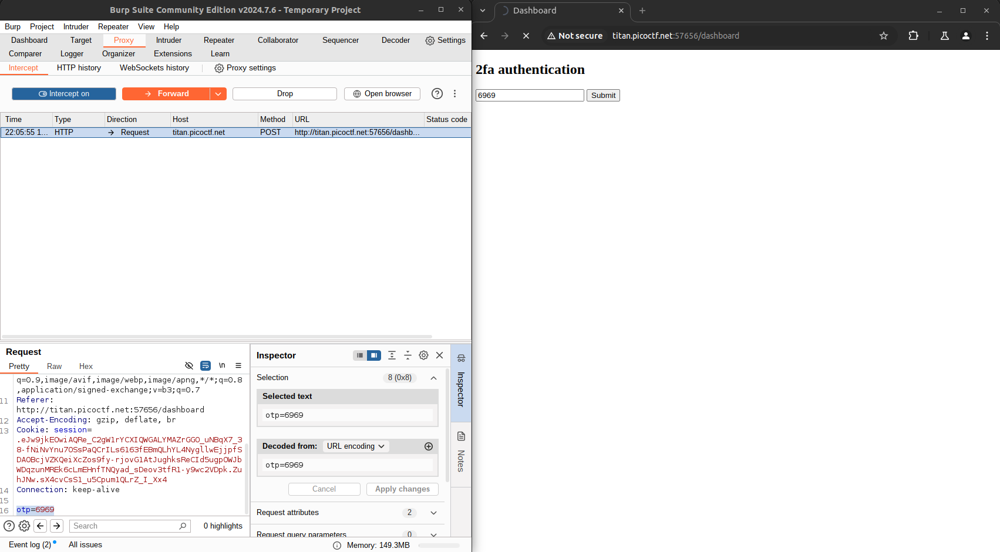
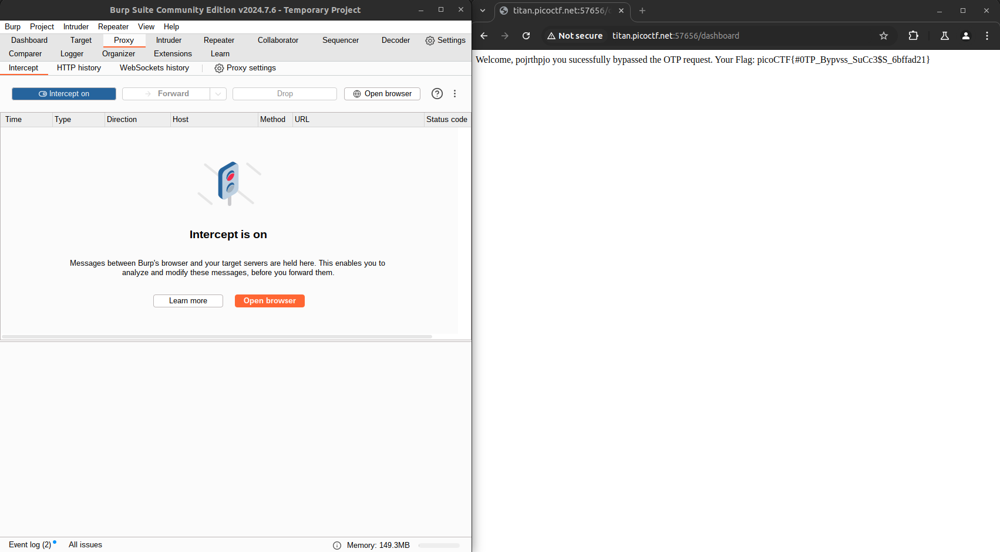

# Author: Nana Ama Atombo-Sackey & Sabine Gisagara

# Description:
- Try [here](http://titan.picoctf.net:57656/) to find the flag

# Hints:
1. Try using burpsuite to intercept request to capture the flag.
2. Try mangling the request, maybe their server-side code doesn't handle malformed requests very well.

# Solution:
- Use Burpsuite to access the link
- Type anything you want into those Registration textbox and click Register
- Click Forward on Burpsuite until the browser go to the OTP input textbox

- Type a random OTP in it then Submit
- Delete the otp line in Burpsuite

- Click Forward and the flag will appear

# Flag:
picoCTF{#0TP_Bypvss_SuCc3$S_6bffad21}