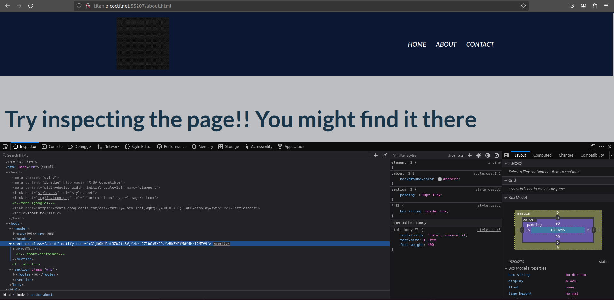
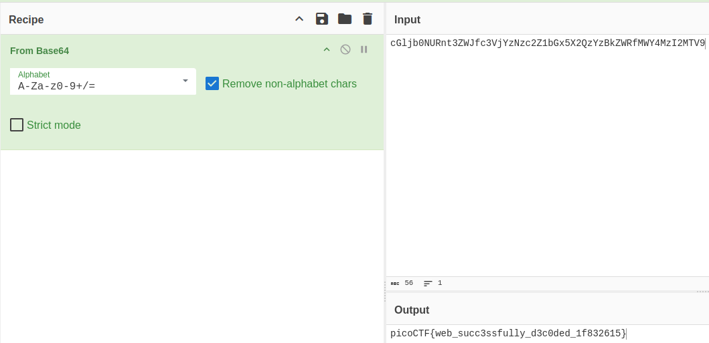

# Author: Nana Ama Atombo-Sackey

# Description:
- Do you know how to use the web inspector?
- Start searching [here](http://titan.picoctf.net:55207/index.html) to find the flag

# Hints:
1. Use the web inspector on other files included by the web page.
2. The flag may or may not be encoded.

# Solution:
- I use the Inspect tab and search everything i can. Then i see something like a Base64 code

- Base64 decode

# Flag:
picoCTF{web_succ3ssfully_d3c0ded_1f832615}